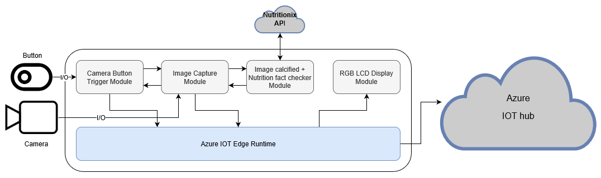

# Food Nutrition Finder + Custom Vision + Azure IoT Edge on a Raspberry Pi 3
### Communication between modules

Ref1: [Azure IOT edge concepts](https://docs.microsoft.com/en-us/azure/iot-edge/iot-edge-runtime)

Ref2: [Azure custom vision sample](https://azure.microsoft.com/en-us/resources/samples/custom-vision-service-iot-edge-raspberry-pi/)
